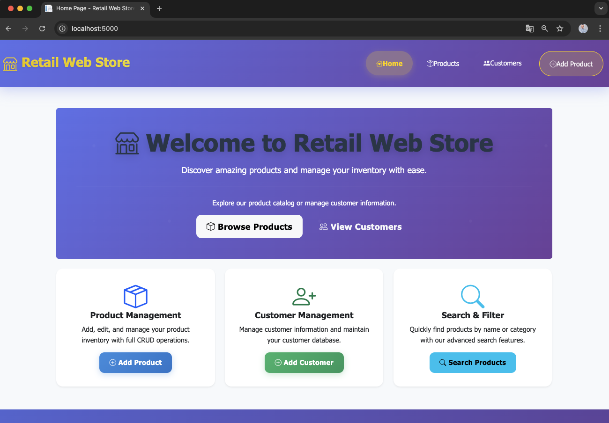
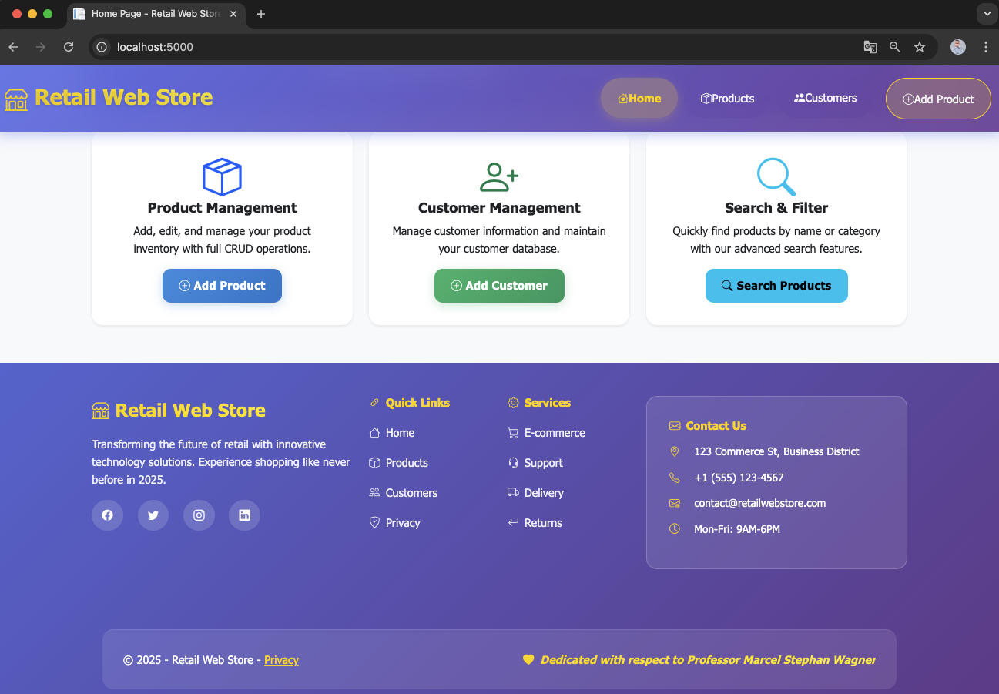
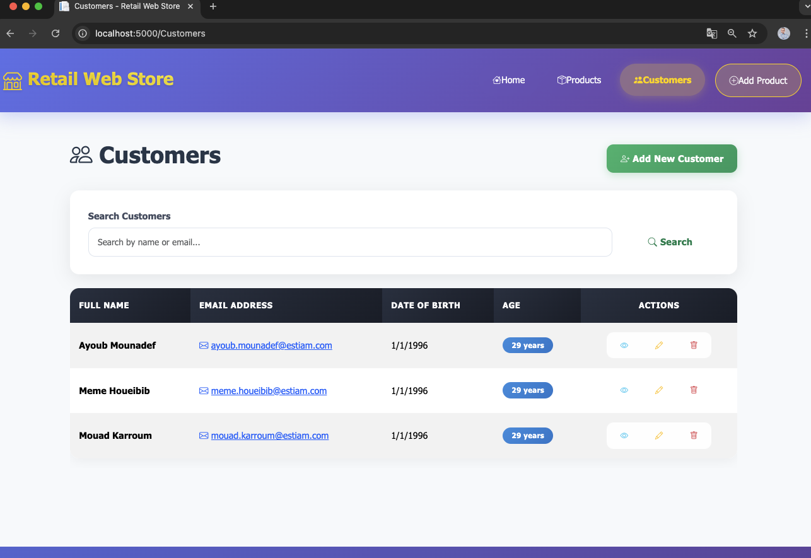
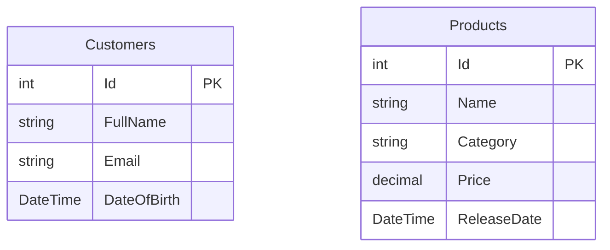

# 🛒 Retail Web Store

<div align="center">


**A modern ASP.NET Core MVC e-commerce platform with clean architecture and professional design.**

[🚀 Live Demo](http://localhost:5000) • [📖 Documentation](#-documentation) • [🐛 Report Bug](../../issues) • [✨ Request Feature](../../issues)

---

### 🎯 Dedicated with respect to **Professor Marcel Stefan Wagner, PhD** • Estiam 2025

</div>

---

## 👥 Development Team

<table align="center">
  <tr>
    <td align="center">
      
      <br />
      <sub><b>Ayoub Mounadef</b></sub>
      <br />
      <a href="mailto:ayoub.mounadef@estiam.com">📧 Contact</a>
    </td>
    <td align="center">
      
      <br />
      <sub><b>Meme Houeibib</b></sub>
      <br />
      <a href="mailto:meme.houeibib@estiam.com">📧 Contact</a>
    </td>
    <td align="center">
      
      <br />
      <sub><b>Mouad Karroum</b></sub>
      <br />
      <a href="mailto:mouad.karroum@estiam.com">📧 Contact</a>
    </td>
  </tr>
</table>

---

## ✨ Features

- **Product Management**: Full CRUD operations with search & filtering  
- **Customer Management**: Comprehensive customer database with profiles  
- **Smart Search**: Real-time search with pagination and category filters  
- **Modern UI/UX**: Responsive design with Bootstrap 5 & glassmorphism effects  
- **Entity Framework Core**: Code-first migrations with clean seeding strategy  
- **Dockerized Database**: SQL Server 2022 running in a container  

---

## 🎨 Design Highlights

- Clean **gradient-based palette** with smooth animations  
- **Mobile-first responsive design**  
- **Custom TagHelpers** for Bootstrap integration  
- Professional **typography & spacing** for readability  

---

## 🏗️ Architecture

```

RetailWebProject/
├── 📁 RetailWebProject/
│   ├── Controllers/           # MVC Controllers
│   ├── Data/                  # DbContext & Seed Data
│   ├── Migrations/            # EF Core migrations
│   ├── Models/                # Domain models & enums
│   ├── TagHelpers/            # Custom Razor TagHelpers
│   ├── Views/                 # Razor views
│   └── wwwroot/               # Static assets (CSS, JS, images)
├── 📷 ScreensImagesOfTheProject/ # Screenshots
└── 🐳 docker-compose.yml

````

---

## 🚀 Quick Start Guide

### 🔧 Prerequisites
- [.NET 8 SDK](https://dotnet.microsoft.com/en-us/download/dotnet/8.0)  
- [Docker Desktop](https://www.docker.com/products/docker-desktop)  
- Git

### ⚡ Installation Steps

```bash
# 1️⃣ Clone repository
git clone https://github.com/<your-username>/RetailWebProject.git
cd RetailWebProject

# 2️⃣ Restore dependencies
cd RetailWebProject
dotnet restore

# 3️⃣ Start SQL Server container
docker run -e "ACCEPT_EULA=Y" \
  -e "MSSQL_SA_PASSWORD=Tranquillo123!" \
  -p 1433:1433 \
  --name sqlserver-retail \
  -d mcr.microsoft.com/mssql/server:2022-latest

# 4️⃣ Apply migrations
dotnet ef database update

# 5️⃣ Run application
dotnet run
````

➡️ App runs on: [http://localhost:5000](http://localhost:5000)

---

## 🛠️ How We Built This

1. **Created solution & MVC project**

   ```bash
   dotnet new sln -n RetailWebProject
   dotnet new mvc -n RetailWebProject
   dotnet sln add RetailWebProject/RetailWebProject.csproj
   ```

2. **Added Entity Framework Core packages**

   ```bash
   dotnet add package Microsoft.EntityFrameworkCore.SqlServer
   dotnet add package Microsoft.EntityFrameworkCore.Tools
   dotnet add package Microsoft.EntityFrameworkCore.Design
   ```

3. **Set up Dockerized SQL Server**

   ```bash
   docker run -e "ACCEPT_EULA=Y" \
     -e "MSSQL_SA_PASSWORD=Tranquillo123!" \
     -p 1433:1433 \
     --name sqlserver-retail \
     -d mcr.microsoft.com/mssql/server:2022-latest
   ```

4. **Applied EF migrations**

   ```bash
   dotnet ef migrations add InitialCreate
   dotnet ef database update
   ```

5. **Seeded database with Products & Customers**
   (including special product “Tranquillo” dedicated to our professor)

---

## 📸 Screenshots

<details>
<summary>🏠 Home Page</summary>




</details>

<details>
<summary>👥 Customers</summary>



</details>

---

## 📊 Database Schema



---

## 🌍 Platform Support

| Platform   | Status      | Instructions                        |
| ---------- | ----------- | ----------------------------------- |
| 🪟 Windows | ✅ Supported | Visual Studio 2022 + Docker Desktop |
| 🍎 macOS   | ✅ Supported | .NET 8 SDK + Docker Desktop         |
| 🐧 Linux   | ✅ Supported | .NET 8 SDK + Docker                 |

---

## 📄 License

Licensed under the MIT License. See [LICENSE](LICENSE).

---

## 🙏 Acknowledgments

<div align="center">

This project was built as part of the **Web Project v3** assignment at Estiam (2025).
We dedicate it to **Professor Marcel Stefan Wagner, PhD**, with respect and gratitude.

<sub>Made with ❤️ by the Retail Web Store Team</sub>

</div>

[](#-retail-web-store)

